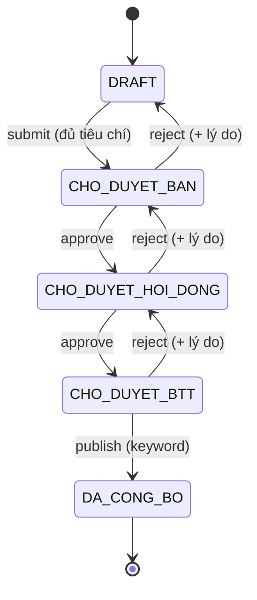

# Reference — State machine bảng điểm

Nguồn chân lý: `src/lib/state-machine.ts` sau Phase 1. File này là bản đối chiếu cho test + docs.

---

## Trạng thái (`ScoreState`)

| Mã | Nhãn (`SCORE_STATE_LABELS`) | Badge variant | Ý nghĩa |
|---|---|---|---|
| `DRAFT` | Nháp | `secondary` | Chuyên viên đang chấm, chưa nộp |
| `CHO_DUYET_BAN` | Chờ duyệt Ban | `info` | Đã nộp, chờ Lãnh đạo Ban |
| `CHO_DUYET_HOI_DONG` | Chờ Hội đồng TĐKT | `info` | Ban đã duyệt, chờ Hội đồng |
| `CHO_DUYET_BTT` | Chờ Ban thường trực | `warning` | Hội đồng đã duyệt, chờ công bố |
| `DA_CONG_BO` | Đã công bố | `success` | Chốt, **bất biến** |

---

## Bảng chuyển (`TRANSITIONS`)

| Từ | Hành động | Đến | Ai (role) | Điều kiện thêm |
|---|---|---|---|---|
| `DRAFT` | `submit` | `CHO_DUYET_BAN` | SPECIALIST | đã chấm đủ mọi tiêu chí (`isRecordComplete`) |
| `CHO_DUYET_BAN` | `approve` | `CHO_DUYET_HOI_DONG` | BAN_LEADER | scope banId khớp |
| `CHO_DUYET_BAN` | `reject` | `DRAFT` | BAN_LEADER | có `reason` |
| `CHO_DUYET_HOI_DONG` | `approve` | `CHO_DUYET_BTT` | COUNCIL_CHAIR | (VICE chỉ xem) |
| `CHO_DUYET_HOI_DONG` | `reject` | `CHO_DUYET_BAN` | COUNCIL_CHAIR | có `reason` |
| `CHO_DUYET_BTT` | `publish` | `DA_CONG_BO` | STANDING_COMMITTEE | keyword "CÔNG BỐ" ở UI |
| `CHO_DUYET_BTT` | `reject` | `CHO_DUYET_HOI_DONG` | STANDING_COMMITTEE | có `reason` — **thêm ở B4** |

Mọi cặp `(from, action)` không có trong bảng → `INVALID_TRANSITION`.
`from === 'DA_CONG_BO'` → `FINAL_STATE` (chặn trước khi tra bảng).

---

## Sơ đồ

---

## Lỗi `applyTransition` (`TransitionErr.error`)

| Code | Khi nào | HTTP (MSW) | Message tiếng Việt |
|---|---|---|---|
| `INVALID_TRANSITION` | cặp (from, action) không hợp lệ | 409 | Không thể thực hiện thao tác này ở bước hiện tại |
| `REASON_REQUIRED` | `reject` không lý do | 409 | Vui lòng nhập lý do trả lại |
| `INCOMPLETE_SCORING` | `submit` khi thiếu tiêu chí | 409 | Cần chấm đủ tất cả tiêu chí trước khi nộp |
| `FINAL_STATE` | thao tác trên `DA_CONG_BO` | 409 | Kết quả đã công bố, không thể thay đổi |
| `FORBIDDEN` | RBAC chặn (ở MSW, không phải applyTransition) | 403 | Bạn không có quyền thực hiện thao tác này |

---

## Map trạng thái địa phương (`toLocalityStatus`)

| `record` | → `LocalityStatus` | Nhãn |
|---|---|---|
| `state === 'DA_CONG_BO'` | `published` | Công bố |
| `state ∉ {DRAFT, DA_CONG_BO}` | `processing` | Đang xử lý |
| `state === 'DRAFT'` && `submittedAt != null` | `submitted` | Đã nộp |
| `state === 'DRAFT'` && `submittedAt == null` | `processing` | Đang xử lý |

> Lưu ý: `DRAFT` + `submittedAt != null` xảy ra sau khi bị `reject` từ `CHO_DUYET_BAN` (đã từng nộp).

---

## `scoreCriterion` (không phải transition)

- Chỉ khi `record.state !== 'DA_CONG_BO'`.
- `value` clamp `[0, criteria.maxScore]`.
- Upsert entry theo `criteriaId`; `totalScore = Σ entries.value`.
- Audit: `action` = `SCORE` (entry mới) hoặc `EDIT` (đã có), `fieldName = \`${criteriaId} - ${localityId}\``, `oldValue` = giá trị cũ hoặc null.
- RBAC: `can(user, 'edit', { state: record.state, scope: { localityId } })`.
